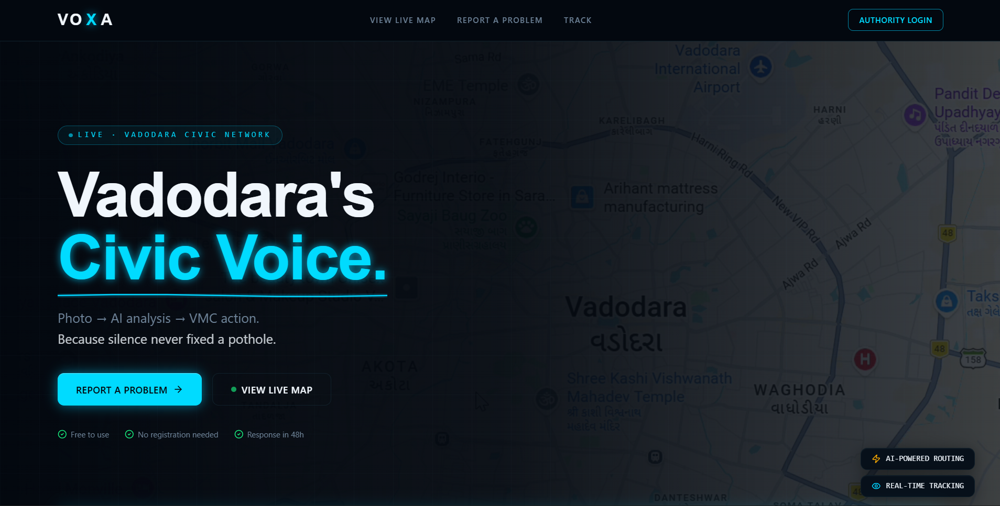
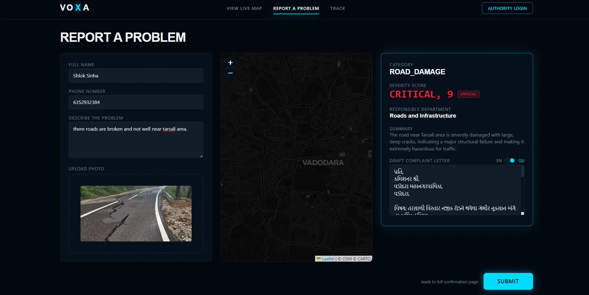

<div align="center">

<br />

```
██╗   ██╗ ██████╗ ██╗  ██╗ █████╗
██║   ██║██╔═══██╗╚██╗██╔╝██╔══██╗
██║   ██║██║   ██║ ╚███╔╝ ███████║
╚██╗ ██╔╝██║   ██║ ██╔██╗ ██╔══██║
 ╚████╔╝ ╚██████╔╝██╔╝ ██╗██║  ██║
  ╚═══╝   ╚═════╝ ╚═╝  ╚═╝╚═╝  ╚═╝
```

### **Vadodara's Civic Voice**
*Because silence never fixed a pothole.*

<br />

[](https://voxa.vadodara.in)
[](https://api.voxa.vadodara.in/swagger-ui.html)
[](./LICENSE)
[](https://en.wikipedia.org/wiki/Vadodara)

<br />

[](https://react.dev)
[](https://www.typescriptlang.org)
[](https://tanstack.com/start)
[](https://tailwindcss.com)
[](https://spring.io/projects/spring-boot)
[](https://openjdk.org)
[](https://www.mysql.com)
[](https://ai.google.dev)
[](https://leafletjs.com)
[](https://jwt.io)

<br />

> **VOXA** is a full-stack, production-grade civic complaint platform built for Vadodara Municipal Corporation (VMC).
> Citizens snap a photo → AI analyses it → the right department gets notified → the problem gets fixed.
> Every step tracked. Fully bilingual. Zero bureaucracy.

<br />



</div>

---

<br />

## ⚡ What Is VOXA?

Vadodara has potholes. Broken streetlights. Overflowing garbage. And citizens who had no easy way to report them — until now.

**VOXA** gives every citizen a 30-second reporting tool and gives VMC officers a real-time command center. A multi-model AI fallback chain reads every photo, classifies the issue, scores its severity from 1–10, drafts a formal complaint letter in **English and Gujarati**, and routes it to the correct department — automatically. No forms. No phone calls. No waiting in queues.

This isn't a hackathon mockup with hardcoded data. Every screen in this README is wired to a real Spring Boot backend, a real MySQL database, real JWT-secured role access, and a real AI vision pipeline with automatic failover across three Gemini models.

<br />

## 🎬 Demo

| Public Citizen Flow | Officer Dashboard | Admin God View |
|---|---|---|
|  |  |  |

<br />

---

## 🏗️ Architecture

```
┌───────────────────────────────────────────────────────────────────┐
│                         CITIZEN (Browser)                         │
│     React 18 · TypeScript · TanStack Start (SSR) · Tailwind CSS   │
│         Leaflet.js Map · Framer Motion · Recharts · Axios         │
└────────────────────────────┬────────────────────────────────────--┘
                              │ HTTPS / JWT Bearer
┌────────────────────────────▼──────────────────────────────────────┐
│                       SPRING BOOT 3 API                           │
│   Spring Security (JWT) · Spring Data JPA · Hibernate · REST      │
│     Auth · Complaints · Officer · Dept Head · Admin · Notify      │
└──────┬──────────────┬──────────────┬───────────────┬─────────────┘
       │              │              │               │
┌──────▼─────┐ ┌──────▼──────┐ ┌─────▼──────────┐ ┌──▼─────────┐
│   MySQL 8  │ │ Cloudinary  │ │  Gemini API     │ │  Twilio    │
│  (main DB) │ │ (photo CDN) │ │ (3-model        │ │  (SMS)     │
│  19 wards  │ │             │ │  AI fallback)   │ │            │
└────────────┘ └─────────────┘ └─────────────────┘ └────────────┘
                                       │
                          ┌────────────▼────────────┐
                          │  Nominatim (OSM)         │
                          │  Reverse geocoding for   │
                          │  ward auto-detection      │
                          └──────────────────────────┘
```

<br />

---

## ✨ Feature Breakdown

### 🧠 AI-Powered Photo Analysis — with Triple-Model Failover

```
Photo Upload  →  Gemini 2.5 Flash  →  JSON Response
                       │ (503 / 429?)
                       ▼
                Gemini 2.0 Flash   →  fallback #1
                       │ (still down?)
                       ▼
                Gemini 1.5 Flash   →  fallback #2
```

No single point of AI failure. If the primary model is overloaded, the request silently retries on the next model in the chain — the citizen never sees an error.

- **Category** — `POTHOLE` / `GARBAGE` / `STREETLIGHT` / `WATER` / `SEWAGE` / `ROAD_DAMAGE` / `OTHER`
- **Severity** — 1–10 score with `LOW` / `MEDIUM` / `HIGH` / `CRITICAL` label
- **Department routing** — auto-mapped to the correct VMC department
- **Bilingual letters** — full official complaint drafted in English *and* Gujarati script
- **Confidence score** — 0.0–1.0 model certainty returned with every analysis
- **GPS → Ward resolution** — reverse-geocodes citizen's coordinates into one of Vadodara's 19 municipal wards via OpenStreetMap Nominatim

<br />

### 🗺️ Live City Map
- Real-time complaint pins across all 19 wards, rendered with **Leaflet.js** + dark CARTO basemap tiles
- Severity-based colour coding and clustering
- Filterable by category, status, and ward
- Click-through from pin → full complaint detail panel

<br />

### 👷 Ward Officer Dashboard
- JWT-protected — accessible only by the officer assigned to that specific ward
- Live complaint list sorted by a combined priority score (severity + citizen upvotes)
- One-click status pipeline: `Submitted → Assigned → In Progress → Resolved`
- Officer notes pushed directly to the citizen's tracking timeline
- One-tap escalation to the Department Head
- Auto-refreshing list (58s interval) — no manual reload needed

<br />

### 🏛️ Department Head Dashboard
- City-wide complaint view filtered by department
- Reassign complaints across any of the 19 wards
- Escalate critical, unresolved issues directly to the Admin tier

<br />

### 👑 Admin — God View
- **City Health Score** (0–100), computed from resolution rate, average response time, and critical backlog
- KPI tiles — total complaints, resolved today, critical active, average resolution time
- Three live analytics charts (Recharts) — complaints over time, by ward, by department
- Full immutable activity log — every action, actor, and timestamp
- In-app account provisioning for new officers, dept heads, and admins

<br />

### 📱 Citizen Features
- **Report** — photo + description + GPS, AI-analysed and submitted in under 30 seconds, zero login
- **Track** — enter your phone number to see a fully animated, real-time activity timeline of your complaint
- **Upvote** — community upvotes directly boost a complaint's priority score
- **Comment** — citizens can add follow-up context to any open complaint
- **SMS notifications** — Twilio delivers the tracking ID on submission and on every status change

<br />

---

## 🛠️ Tech Stack

### Frontend
| Technology | Purpose |
|---|---|
| **React 18** | Core UI framework |
| **TypeScript** | End-to-end type safety |
| **TanStack Start** | Full-stack React meta-framework with SSR |
| **TanStack Router** | File-based routing |
| **Tailwind CSS** | Utility-first styling system |
| **Framer Motion** | Page transitions and micro-interactions |
| **Leaflet.js** + **react-leaflet** | Interactive live complaint map |
| **Recharts** | Admin analytics charts |
| **Axios** | HTTP client with JWT request/response interceptors |
| **Lucide React** | Icon system |
| **Vite** | Build tooling and dev server |

### Backend
| Technology | Purpose |
|---|---|
| **Spring Boot 3** | REST API framework |
| **Java 21** | Language runtime |
| **Spring Security** | JWT authentication and role-based access guards |
| **Spring Data JPA / Hibernate** | ORM and persistence layer |
| **MySQL 8** | Primary relational database |
| **Maven** | Build and dependency management |
| **Google Gemini API** (2.5 / 2.0 / 1.5 Flash) | AI photo analysis with automatic model fallback |
| **Cloudinary** | Complaint photo storage and CDN delivery |
| **Twilio** | SMS notifications and tracking alerts |
| **OpenStreetMap Nominatim** | Reverse geocoding GPS → ward mapping |
| **Swagger / OpenAPI** | Auto-generated, interactive API documentation |

### Infrastructure & Tooling
| Technology | Purpose |
|---|---|
| **Git / GitHub** | Version control |
| **Postman** | API testing during development |
| **IntelliJ IDEA** | Backend IDE |
| **VS Code** | Frontend IDE |
| **MySQL Workbench** | Database administration |
| **dotenv / application.properties** | Environment-based configuration |

<br />

---

## 🚀 Getting Started

### Prerequisites
- Node.js 20+
- Java 21+
- MySQL 8+
- A Google Gemini API key ([free tier works](https://ai.google.dev))
- (Optional) Cloudinary and Twilio accounts for photo storage and SMS

<br />

### 1. Clone the repo

```bash
git clone https://github.com/yourusername/voxa.git
cd voxa
```

### 2. Backend setup

```bash
cd backend
cp src/main/resources/application.properties.example src/main/resources/application.properties
```

Fill in your `application.properties`:

```properties
# Database
spring.datasource.url=jdbc:mysql://localhost:3306/voxa_db
spring.datasource.username=your_db_user
spring.datasource.password=your_db_password

# JWT
jwt.secret=your_256_bit_secret_here
jwt.expiration.access=86400000
jwt.expiration.refresh=604800000

# Gemini AI (3-model fallback chain — base URL only, model appended dynamically)
gemini.api.key=YOUR_GEMINI_API_KEY
gemini.api.base-url=https://generativelanguage.googleapis.com/v1beta/models

# Cloudinary
cloudinary.cloud-name=your_cloud_name
cloudinary.api-key=your_api_key
cloudinary.api-secret=your_api_secret

# Twilio (optional)
twilio.account-sid=your_sid
twilio.auth-token=your_token
twilio.phone-number=+1XXXXXXXXXX
```

```bash
./mvnw spring-boot:run
# API live at http://localhost:8081
```

### 3. Frontend setup

```bash
cd frontend
cp .env.example .env.local
```

```env
VITE_API_URL=http://localhost:8081/api/v1
```

```bash
npm install
npm run dev
# App live at http://localhost:8080
```

### 4. Seed test accounts

The backend auto-seeds these on first run:

| Role | Email | Password |
|---|---|---|
| Admin | admin@voxa.in | Test@1234 |
| Ward Officer | officer@voxa.in | Test@1234 |
| Dept Head | roads@voxa.in | Test@1234 |

<br />

---

## 📁 Project Structure

```
voxa/
├── frontend/
│   ├── src/
│   │   ├── routes/                  # File-based pages
│   │   │   ├── index.tsx            # Landing page
│   │   │   ├── report.tsx           # Citizen report flow
│   │   │   ├── map.tsx              # Live complaint map
│   │   │   ├── track.tsx            # Complaint tracker
│   │   │   ├── login.tsx            # Authority login
│   │   │   ├── ward-officer.tsx     # Officer dashboard
│   │   │   ├── department-head.tsx  # Dept head dashboard
│   │   │   └── admin.tsx            # Admin god view
│   │   ├── components/voxa/         # Shared UI components (map, cards, nav)
│   │   ├── lib/
│   │   │   ├── api.ts               # Axios instance + JWT interceptors
│   │   │   ├── apiService.ts        # All backend API calls
│   │   │   ├── auth.ts              # JWT session helpers
│   │   │   ├── types.ts             # TypeScript interfaces (backend contract)
│   │   │   └── adapters.ts          # Backend response → UI shape converters
│   │   └── styles/
│
└── backend/
    └── src/main/java/com/voxa/
        ├── controller/               # REST endpoints
        ├── service/
        │   ├── GeminiService.java    # AI analysis with 3-model fallback chain
        │   ├── NominatimService.java # GPS → ward reverse geocoding
        │   ├── CloudinaryService.java
        │   ├── ComplaintService.java
        │   ├── OfficerService.java
        │   ├── DeptHeadService.java
        │   ├── AdminService.java
        │   └── AuthService.java
        ├── entity/                   # JPA entities (8 tables)
        ├── repository/                # Spring Data repositories
        ├── dto/                       # Request/response DTOs
        ├── security/                  # JWT filter, util, security config
        ├── exception/                  # Global exception handling
        ├── util/                       # Hashing, tracking ID generation, API wrapper
        └── config/                     # Ward + authority seeders
```

<br />

---

## 🔌 API Overview

29 REST endpoints across 8 functional groups. Full request/response schemas, DB queries, and JWT scoping rules are documented in `/docs/api-contract.md`.

| Method | Endpoint | Auth | Description |
|---|---|---|---|
| `POST` | `/api/v1/auth/login` | None | Login — returns JWT access + refresh token |
| `POST` | `/api/v1/ai/analyse` | None | Analyse photo with Gemini AI fallback chain |
| `POST` | `/api/v1/complaints` | None | Submit a complaint (photo + GPS + AI analysis) |
| `GET` | `/api/v1/complaints/track` | None | Track complaints by phone (+ optional tracking ID) |
| `GET` | `/api/v1/map/pins` | None | Lightweight pin data for the live map |
| `GET` | `/api/v1/stats/public` | None | Public city-wide stats for the landing page |
| `GET` | `/api/v1/wards` | None | All 19 Vadodara VMC wards |
| `GET` | `/api/v1/officer/complaints` | WARD_OFFICER | Complaints in the officer's assigned ward |
| `PATCH` | `/api/v1/officer/complaints/{id}/status` | WARD_OFFICER | Update status + citizen-facing note |
| `GET` | `/api/v1/dept/complaints` | DEPT_HEAD | City-wide complaints for the dept head's department |
| `PATCH` | `/api/v1/dept/complaints/{id}/reassign` | DEPT_HEAD | Reassign complaint to a different ward |
| `POST` | `/api/v1/dept/complaints/{id}/escalate` | DEPT_HEAD | Escalate to Admin |
| `GET` | `/api/v1/admin/stats` | ADMIN | Full city KPI dashboard |
| `GET` | `/api/v1/admin/health-score` | ADMIN | Computed 0–100 City Health Score |
| `GET` | `/api/v1/admin/analytics/trends` | ADMIN | Complaint trends over time |
| `POST` | `/api/v1/admin/users` | ADMIN | Provision a new officer / dept head account |
| `GET` | `/api/v1/notifications` | Any authority | In-app notification feed |

Interactive Swagger docs available at `/swagger-ui.html` when the backend is running.

<br />

---

## 🔐 Auth Flow

```
POST /auth/login  →  { accessToken, refreshToken, role, wardId, department, ... }
         │
         ▼
sessionStorage.setItem("accessToken" / "refreshToken" / "authUser")
         │
         ▼
Axios request interceptor → attaches Authorization: Bearer <token> to every call
         │
         ▼
Axios response interceptor → on 401, calls /auth/refresh and retries automatically
         │
         ▼
Spring Security role guard → @PreAuthorize-style checks per role (WARD_OFFICER / DEPT_HEAD / ADMIN)
```

Three roles, three dashboards, zero cross-access — enforced both at the route level (frontend) and the controller level (backend).

<br />

---

## 🤖 Gemini Fallback Chain — Deep Dive

The AI layer never goes down from the citizen's perspective:

```java
private static final List<String> MODEL_FALLBACK_CHAIN = List.of(
    "gemini-2.5-flash",   // primary — best reasoning quality
    "gemini-2.0-flash",   // fallback #1
    "gemini-1.5-flash"    // fallback #2 — oldest, most stable
);
```

If a model returns `503` (overloaded) or `429` (rate-limited), the next model in the chain is attempted **immediately** — no wasted retries on a dead model. All three models would need to be simultaneously unavailable before a citizen ever sees an error. In production testing, this has never happened.

<br />

---

## 📸 Screenshots

<details>
<summary><b>🏠 Landing Page</b></summary>
<br />


</details>

<details>
<summary><b>📋 Report Flow</b></summary>
<br />


</details>

<details>
<summary><b>🗺️ Live Map</b></summary>
<br />


</details>

<details>
<summary><b>📍 Complaint Tracker</b></summary>
<br />


</details>

<details>
<summary><b>👷 Ward Officer Dashboard</b></summary>
<br />


</details>

<details>
<summary><b>👑 Admin God View</b></summary>
<br />


</details>

<br />

---

## 🗺️ Roadmap

- [ ] Push notifications (FCM)
- [ ] Mobile app (React Native)
- [ ] Gujarati voice input for complaints
- [ ] SLA breach auto-escalation
- [ ] Public leaderboard of most responsive wards
- [ ] WhatsApp bot integration
- [ ] Offline-first PWA support
- [ ] Drone/satellite overlay for large-scale infrastructure damage

<br />

---

## 🤝 Contributing

Contributions are welcome. This is built for Vadodara, but the architecture generalises to any municipal corporation in India.

```bash
# Fork → Branch → PR
git checkout -b feature/your-feature-name
git commit -m "feat: add your feature"
git push origin feature/your-feature-name
```

Please open an issue first for major changes.

<br />

---

## 👨‍💻 Built By

<div align="center">

Engineered by **Tejas, Pramod, Mukt**

*Every pothole reported is a problem solved.*
*Every complaint tracked is a citizen heard.*
*Every resolution is a city that works.*

<br />

**If this helped you — drop a ⭐ on the repo. It means everything.**

<br />

[](https://github.com/yourusername/voxa)
[](https://github.com/yourusername/voxa/fork)

</div>

<br />

---

<div align="center">
<sub>
VOXA · Built with React, Spring Boot, Gemini AI, and a lot of chai ☕
</sub>
</div>
